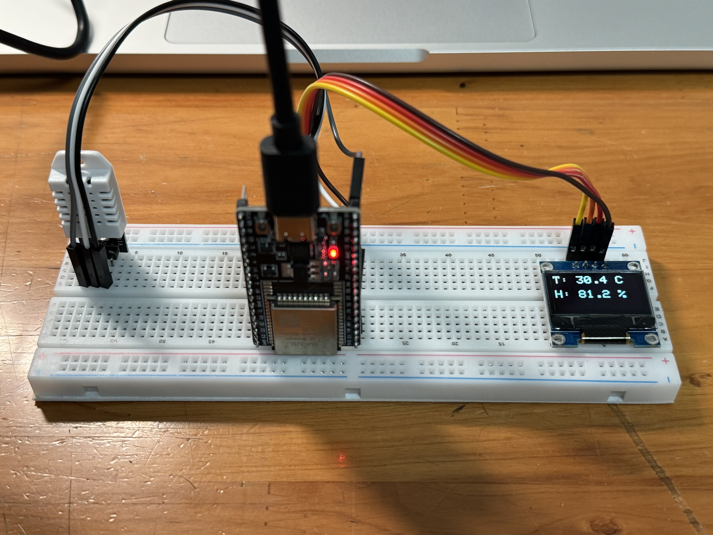
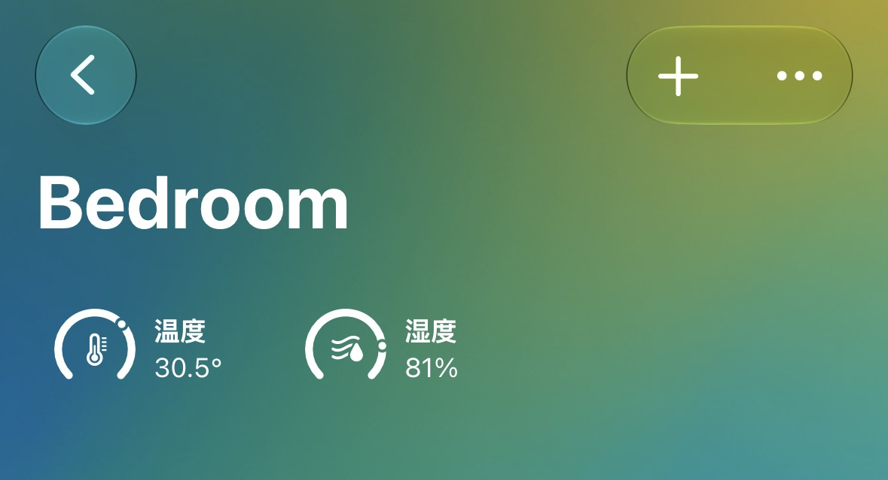

# ESP32-HomeKit-Temperature-Humidity-Monitor
A smart temperature and humidity sensor based on ESP32, DHT22 and SSD1306 OLED, compatible with Apple HomeKit.

## Features
- Real-time temperature monitoring
- Real-time humidity monitoring
- Apple HomeKit integration
- OLED display
- WiFi support
- OTA ready (optional)
